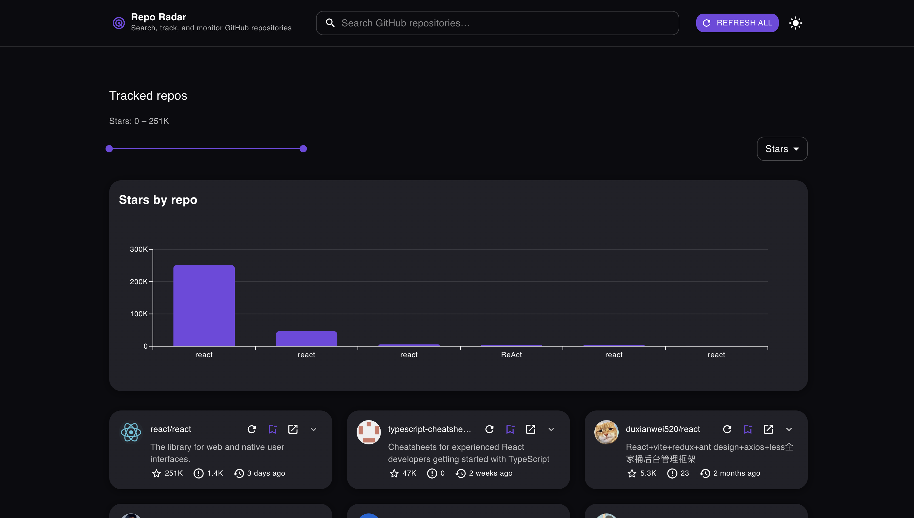
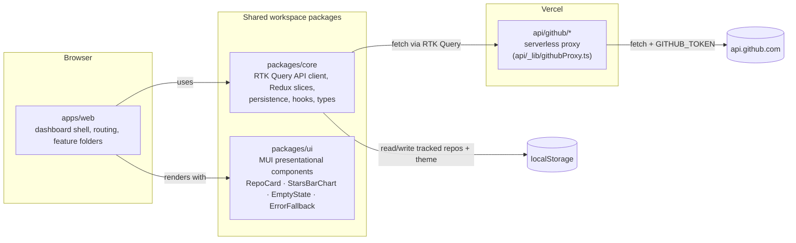
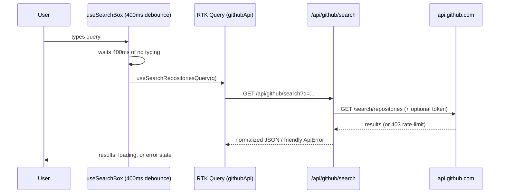

# 📡 Repo Radar

**Search GitHub repositories, track your favorites, and monitor their latest stats - stars, open issues, and last commit - all in one dashboard.**

<p>
  <a href="https://github.com/PierreAdel/repo-radar-app/actions/workflows/ci.yml"></a>
  
  
  
  
</p>

**🔗 Live demo:** `<VERCEL_URL_HERE>` · **📦 Repo:** [github.com/PierreAdel/repo-radar-app](https://github.com/PierreAdel/repo-radar-app)

> Built for the Siemens Senior Frontend take-home ("Repo Radar"). This README covers the
> demo, architecture and technical decisions, and the assumptions/limitations made along
> the way, as requested in the brief.

---

## Table of Contents

1. [Demo](#-demo)
2. [Features](#-features)
3. [Tech Stack](#-tech-stack)
4. [Architecture](#-architecture)
5. [Reliability & Resilience](#-reliability--resilience)
6. [Security](#-security)
7. [API Rate-Limit Handling](#-api-rate-limit-handling)
8. [Performance](#-performance)
9. [Accessibility](#-accessibility)
10. [Scalability & Maintainability](#-scalability--maintainability)
11. [Observability & Monitoring](#-observability--monitoring)
12. [Folder Structure](#-folder-structure)
13. [Getting Started](#-getting-started)
14. [Development](#-development)
15. [Testing](#-testing)
16. [CI/CD](#-cicd)
17. [Release Process](#-release-process)
18. [Assumptions & Limitations](#-assumptions--limitations)
19. [Contributing](#-contributing)
20. [License](#-license)
21. [Contact](#-contact)

---

## 🎬 Demo

<!-- TODO: capture real screenshots/GIFs - see docs/screenshots/README.md for the shot list -->


<table>
<tr>
<td width="50%">

**Debounced search**

Type a query and results load ~400ms after you stop typing - no request-per-keystroke.

</td>
<td width="50%">

**Track / untrack a repo**

One click adds a repo to your tracked list; one click removes it.

</td>
</tr>
<tr>
<td width="50%">

**Tracked Repos view**

Stars, open issues, and last commit date per repo, at a glance.

</td>
<td width="50%">

**Refresh (per repo)**

Pull fresh stats for one repo without touching the others.

</td>
</tr>
<tr>
<td width="50%">

**Independent loading & error states**

Every card loads, errors, and retries on its own - one flaky repo never blocks the rest.

</td>
<td width="50%">

**Survives a reload**

Tracked repos are saved to `localStorage` and restored on the next visit.

</td>
</tr>
</table>

**Bar chart of stars per tracked repo**


---

## ✅ Features

Mapped directly to the ticket's core requirements:

- [x] Debounced GitHub repository search (400ms, URL-synced query)
- [x] Track / untrack repositories
- [x] Tracked Repos view
- [x] Shows stars, open issues, and last commit date per repo
- [x] Refresh individual repos (+ automatic refresh on reconnect/window focus)
- [x] Independent loading and error states per repo
- [x] Tracked repos persisted via `localStorage` (survives reload)
- [x] Proper TypeScript types throughout (strict mode, zero `any` in domain code)
- [x] Bar chart of stars per tracked repository

---

## 🧰 Tech Stack

| Tool                                    | Why                                                                                                                                                                           |
| --------------------------------------- | ----------------------------------------------------------------------------------------------------------------------------------------------------------------------------- |
| **React 19 + TypeScript + Vite**        | Required by the brief; Vite for fast local dev and small, predictable production builds.                                                                                      |
| **Redux Toolkit + RTK Query**           | One library for both client state (tracked repo IDs, theme) and server-cache state (per-repo async data, retries, refetch-on-focus) - no second data-fetching library needed. |
| **MUI + `@mui/x-charts`**               | Required by the brief; `x-charts` gives an accessible, themeable bar chart for free instead of hand-rolling SVG.                                                              |
| **pnpm workspaces + Turborepo**         | Required (monorepo); pnpm workspaces for fast, disk-efficient installs, Turborepo for cached/parallel task pipelines (`build`, `lint`, `test`) across packages.               |
| **Vercel (app + serverless functions)** | Required deploy target; its `api/` convention doubles as the GitHub API proxy with zero extra infra.                                                                          |
| **Sentry**                              | Error tracking + Web Vitals on both the browser app and the serverless functions.                                                                                             |
| **Playwright + axe-core**               | Real-browser e2e coverage of critical flows, with accessibility assertions built into the same specs.                                                                         |
| **Lighthouse CI**                       | Enforced performance budgets (LCP/TBT/CLS) on every preview deploy, not just a manual spot-check.                                                                             |
| **k6**                                  | Load-tests GitHub's search/repo-lookup APIs under sustained concurrency (manual CI trigger).                                                                                  |

---

## 🏗 Architecture

### Package & data-flow overview



### Request lifecycle (search)



### Monorepo structure - and why this split

pnpm workspaces (`apps/*`, `packages/*`, see `pnpm-workspace.yaml`) plus Turborepo for
cached, parallelized task pipelines (`turbo.json`) - a lighter-weight combination than
Nx or Lerna for a project this size, while still giving isolated builds/lint/test/typecheck
per package.

| Package         | Contents                                                                                                                                                                                                                                                                        |
| --------------- | ------------------------------------------------------------------------------------------------------------------------------------------------------------------------------------------------------------------------------------------------------------------------------- |
| `apps/web`      | The dashboard app (deployed to Vercel). Routing, layout, and feature folders: `features/search`, `features/tracked-repos`, `features/stats-chart`.                                                                                                                              |
| `packages/core` | Framework-agnostic domain logic: the GitHub API client (`src/api/githubApi.ts`, RTK Query), Redux slices (`trackedReposSlice`, `themeSlice`), the `localStorage` persistence middleware, `useDebouncedValue`, and shared types (`GithubRepo`, `ApiError`, `SearchReposResult`). |
| `packages/ui`   | Shared, MUI-based presentational components with Storybook + snapshot tests: `RepoCard`, `StarsBarChart`, `EmptyState`, `ErrorFallback`, `OfflineBanner`, and the app's theme factory.                                                                                          |
| `api/`          | Vercel serverless functions - the GitHub API proxy (see below). Part of the root workspace, not a `packages/*` entry.                                                                                                                                                           |

> **On the ticket's "package for the needed plots":** `StarsBarChart` lives inside
> `packages/ui` alongside the other shared components rather than in its own
> `packages/charts`. See [Assumptions & Limitations](#-assumptions--limitations) for the
> reasoning.

### State & data-layer design

- **Client state** (`packages/core/src/store/trackedReposSlice.ts`) is deliberately
  minimal: `{ fullNames: string[] }` - just which repos are tracked, not their data.
  There's no separate `TrackedRepo` type; a tracked repo's stats are joined from the
  RTK Query cache by `fullName` at read time (`useTrackedRepoCacheEntries.ts`).
- **Server-cache state** (loading/error/data per repo) comes from RTK Query itself -
  each `TrackedRepoCard` calls `useGetRepositoryQuery(fullName)` independently, so RTK
  Query's normalized cache _is_ the per-repo status map. No hand-rolled loading/error
  bookkeeping was needed.
- **Persistence** is a dedicated Redux listener middleware
  (`persistenceMiddleware.ts`, built with RTK's `createListenerMiddleware`), not ad-hoc
  `localStorage` calls scattered through components: it listens for
  `trackRepo`/`untrackRepo`/theme-change actions and writes the fresh state via
  `saveToStorage()`. Reads (`loadFromStorage()`) are SSR-safe and wrapped in try/catch,
  so a full or blocked `localStorage` degrades gracefully instead of crashing the app.

### Serverless API layer

The browser never calls `api.github.com` directly - every request goes through
`api/github/search.ts` / `api/github/repo.ts`, which delegate to
`api/_lib/githubProxy.ts`. This buys three things:

1. `GITHUB_TOKEN` stays server-side only, never shipped to the browser.
2. `vercel.json`'s CSP can restrict `connect-src` to `'self'` (+ Sentry ingest) - no
   third-party origins the browser talks to directly.
3. One place to normalize GitHub's raw snake_case payloads and error shapes (including
   rate-limit messages) into the app's own types.

---

## 🛡 Reliability & Resilience

- **Per-repo isolation** - each tracked repo's card has its own `isLoading` /
  `isFetching` / `error`, sourced from RTK Query's cache keyed by `fullName`. One
  repo failing to load never blocks or blanks out the others.
- **Retry with backoff** - RTK Query's `retry()` wrapper around the base query, capped
  at 2 retries with exponential backoff - but only for transient failures (5xx,
  network/timeout errors). 4xx responses (including a 403 rate-limit) are **not**
  retried, since retrying those only makes a rate-limit situation worse.
- **Auto-refresh** - `setupListeners(store.dispatch)` gives refetch-on-reconnect and
  refetch-on-window-focus for free, so data quietly catches up after a dropped
  connection or a backgrounded tab.
- **Graceful empty/error UI** - `EmptyState`, `ErrorFallback`, and `OfflineBanner`
  (all in `packages/ui`) cover "no results," "no tracked repos yet," per-card errors,
  and offline browsing, and a root-level error boundary (`AppErrorBoundary`) catches
  anything unexpected instead of a blank screen.

---

## 🔒 Security

- **Token handling** - `GITHUB_TOKEN` is read only inside `api/_lib/githubProxy.ts`
  (server-side, Vercel Functions). It's never included in any response sent to the
  browser and never appears in client bundle code.
- **CSP** - `vercel.json` sets a Content-Security-Policy restricting `connect-src` to
  `'self'` plus the Sentry ingest domain, consistent with the browser only ever
  talking to its own `/api/github/*` routes.
- **Input validation** - the repo-lookup route validates its `fullName` parameter
  (`api/_lib/validation.ts::isValidRepoFullName`) before it's used to build the
  upstream GitHub request.
- **No secrets in source** - enforced as a project-wide floor rule in
  [`CONSTRAINTS.md`](./CONSTRAINTS.md).
- **Dependency security** - no automated dependency-audit tool (e.g. Dependabot,
  `pnpm audit` in CI) is wired in yet; see [Limitations](#-assumptions--limitations).

---

## 🚦 API Rate-Limit Handling

GitHub's REST API allows **60 requests/hour unauthenticated**, **5,000/hour** with a
token. `GITHUB_TOKEN` (optional, server-side only - see [`.env.example`](./.env.example))
raises the deployed app from the former to the latter.

- 403 responses matching GitHub's rate-limit message are caught in
  `githubProxy.ts::normalizeError` and rewritten into a friendly `ApiError`
  ("GitHub API rate limit exceeded. Try again later or configure `GITHUB_TOKEN`."),
  which the UI surfaces via the card's error state with a retry action.
- As noted above, RTK Query's retry wrapper deliberately does **not** retry 4xx
  responses, so a rate-limited request isn't retried straight into a worse rate limit.
- **Known gap**: there's no explicit `Retry-After`/429-header-based backoff yet - see
  [Limitations](#-assumptions--limitations).

---

## ⚡ Performance

- **400ms debounce** on the search input (`useDebouncedValue`) - tuned to cut request
  volume without the search feeling laggy.
- **Memoized selectors** - `useTrackedRepoCacheEntries` uses `createSelector` to read
  every tracked repo's cached data in one pass without subscribing to N separate
  queries per render.
- **List virtualization** - both the search results list and the tracked-repos grid
  switch to `@tanstack/react-virtual` once they have 20+ items, keeping DOM size flat
  regardless of list length.
- **Code-splitting** - `StarsBarChart` (the heaviest dependency in the app, via
  `@mui/x-charts`) is lazy-loaded with `React.lazy`/`Suspense`, so it's not in the
  initial bundle for users who haven't tracked anything yet.
- **Lighthouse CI budgets** - LCP ≤ 2500ms, TBT ≤ 200ms, CLS ≤ 0.1 (blocking gates);
  FCP/Speed Index (warn-only), measured as a 3-run median via `lhci autorun` on every
  preview deploy.
  > **Current status:** staging is measuring **~3.2–3.3s median LCP**, over budget. A
  > fix (deferring Sentry init off the critical path, dropping an unnecessary chart-chunk
  > preload) is written but not yet merged. Flagged here rather than glossed over - see
  > [`CONSTRAINTS.md`](./CONSTRAINTS.md) for the live number.

---

## ♿ Accessibility

- **Zero critical/serious axe violations** on key pages, enforced via
  `@axe-core/playwright` assertions inside the same Playwright specs that cover
  critical flows - accessibility is checked in the same run as functionality, not as
  an afterthought.
- The bar chart's SVG is `aria-hidden`, paired with a visually-hidden text summary of
  the same data for screen readers.
- Track/untrack/refresh controls are standard MUI interactive elements - keyboard
  reachable and operable by default, with visible focus states.
- Loading states use accessible skeletons (announced appropriately) rather than bare
  spinners with no text alternative.

---

## 📈 Scalability & Maintainability

Directly addresses the ticket's named criterion:

- **Validated at scale** - list/grid virtualization is tested against 1,000+ tracked
  repos in `e2e/large-data.spec.ts`, confirming the UI stays responsive well past
  realistic usage.
- **No duplicate fetching as tracked count grows** - RTK Query's normalized,
  key-based cache means tracking the same repo from two places in the UI never issues
  two separate network requests.
- **Client-side state stays small on purpose** - the tracked-repos slice only stores
  `fullNames: string[]`; the actual repo data lives in the RTK Query cache, not
  duplicated into Redux state, so state size grows with _tracked count_, not with
  _data size per repo_.
- **What would change for a multi-user/persistent backend** - the `localStorage`
  read/write calls are already isolated behind one module
  (`packages/core/src/store/persistence.ts`), invoked only from the listener
  middleware. Swapping `localStorage` for a real backend (e.g. per-user tracked-repo
  API) means replacing that one module's implementation - the slice, the middleware
  trigger, and every component that reads tracked state stay unchanged.

---

## 🔭 Observability & Monitoring

- **Sentry** - wired on both sides: the browser app (`VITE_SENTRY_DSN`, initialized in
  `apps/web/src/instrumentation.ts`, covering errors + Web Vitals + session replay) and
  the serverless functions (`SENTRY_DSN`, `api/_lib/sentry.ts`, with every function
  wrapped by `withErrorReporting.ts` so an unhandled exception is reported before a
  generic 500 is returned).
- **Lighthouse CI** acts as a continuous performance monitor, running against every
  preview deploy rather than only on demand.
- **UptimeRobot** polls `/api/health` on an interval, so an outage in the deployed app
  or its serverless functions surfaces as an alert, not silence.

---

## 📁 Folder Structure

```text
repo-radar-app/
├── apps/web/          # The dashboard app - routing, layout, feature folders (search,
│                       #   tracked-repos, stats-chart), deployed to Vercel
├── packages/core/      # Framework-agnostic: RTK Query API client, Redux slices,
│                       #   localStorage persistence, hooks, shared types
├── packages/ui/        # Shared MUI presentational components + Storybook + snapshots
├── api/                # Vercel serverless functions - the GitHub API proxy
├── e2e/                # Playwright end-to-end specs (incl. axe-core a11y checks)
├── load-tests/         # k6 load/stress test scripts (run against api.github.com)
├── scripts/            # CI helper scripts (preview-deploy polling, API smoke test)
├── CONSTRAINTS.md       # This project's written quality bar (coverage, a11y, perf, …)
├── turbo.json           # Turborepo task pipeline config
└── pnpm-workspace.yaml  # Workspace package globs (apps/*, packages/*)
```

---

## 🚀 Getting Started

```bash
git clone https://github.com/PierreAdel/repo-radar-app.git
cd repo-radar-app
pnpm install
```

### Environment variables

All optional - the app runs with none of them set (using the public unauthenticated
GitHub rate limit). Copy `.env.example` to `.env.local` and fill in what you need:

| Variable          | Required? | Purpose                                                                   |
| ----------------- | :-------: | ------------------------------------------------------------------------- |
| `GITHUB_TOKEN`    | optional  | Server-side only. Raises the GitHub REST rate limit from 60/hr → 5000/hr. |
| `SENTRY_DSN`      | optional  | Server-side error tracking for the `/api` functions.                      |
| `VITE_SENTRY_DSN` | optional  | Browser-side error tracking + Web Vitals for the app.                     |

```bash
pnpm dev
```

---

## 🛠 Development

<details>
<summary>Full script reference (click to expand)</summary>

| Script                 | What it does                                                              |
| ---------------------- | ------------------------------------------------------------------------- |
| `pnpm dev`             | Runs `apps/web` in dev mode via Turborepo.                                |
| `pnpm build`           | Builds every workspace package in dependency order (Turborepo-cached).    |
| `pnpm lint`            | Runs ESLint across every workspace.                                       |
| `pnpm typecheck`       | `tsc --noEmit` in every workspace, plus the root project.                 |
| `pnpm test`            | Runs each workspace's Vitest suite, plus the root `api/` suite.           |
| `pnpm test:coverage`   | Same, with coverage thresholds enforced (≥80% lines per workspace).       |
| `pnpm test:snapshots`  | Runs only the snapshot tests.                                             |
| `pnpm check:fast`      | `typecheck` + `eslint .` - a quick local pre-push sanity check.           |
| `pnpm check:task`      | `check:fast` + `test:coverage` - the full local gate before opening a PR. |
| `pnpm e2e`             | Runs the Playwright suite (`e2e/`).                                       |
| `pnpm lighthouse`      | Runs `lhci autorun` against a running build.                              |
| `pnpm stress-test`     | Runs the k6 load tests in `load-tests/`.                                  |
| `pnpm storybook`       | Starts Storybook for `packages/ui` on `:6006`.                            |
| `pnpm build-storybook` | Static Storybook build, output to `packages/ui/storybook-static`.         |
| `pnpm format`          | `prettier --write .`                                                      |

</details>

**Monorepo tooling:** pnpm workspaces for installs/linking, Turborepo (`turbo.json`) for
cached, dependency-ordered task execution across packages. **Pre-commit:** Husky +
`lint-staged` run ESLint (with `--fix`) and Prettier on staged files before a commit can
land.

---

## 🧪 Testing

| Layer              | Tool                                                                        | Gate                                                                           |
| ------------------ | --------------------------------------------------------------------------- | ------------------------------------------------------------------------------ |
| Unit / integration | Vitest (4 configs: root `api/`, `apps/web`, `packages/core`, `packages/ui`) | ≥80% line coverage per workspace, enforced in CI                               |
| Snapshot           | Vitest `toMatchSnapshot()`                                                  | Nontrivial UI components (`RepoCard`, `StarsBarChart`, …)                      |
| End-to-end         | Playwright                                                                  | 7 specs covering search, track/untrack, sort/filter, large-data virtualization |
| Accessibility      | `@axe-core/playwright`                                                      | Zero critical/serious violations, checked inside the e2e specs                 |
| Performance        | Lighthouse CI (`lhci autorun`)                                              | LCP/TBT/CLS budgets on every preview deploy                                    |
| Load / stress      | k6 (`load-tests/`)                                                          | Manual CI trigger, against `api.github.com` directly with an isolated token    |

<details>
<summary>Measured coverage baseline (click to expand)</summary>

| Workspace       | Line coverage |
| --------------- | ------------- |
| `api/`          | 92%           |
| `packages/core` | 92.6%         |
| `packages/ui`   | 80.4%         |
| `apps/web`      | 91.24%        |

Full detail, including the one documented coverage exception (`apps/web/src/main.tsx`
and `instrumentation.ts` - thin bootstrap code, verified by the e2e smoke spec
instead), lives in [`CONSTRAINTS.md`](./CONSTRAINTS.md).

</details>

```bash
pnpm test              # everything
pnpm test:coverage      # everything, with thresholds enforced
pnpm e2e                # Playwright
```

---

## 🔁 CI/CD

<details open>
<summary><code>.github/workflows/ci.yml</code> - runs on every push to <code>main</code>/<code>staging</code> and every PR targeting either</summary>

| Job              | What it does                                                                                                                                                                      |
| ---------------- | --------------------------------------------------------------------------------------------------------------------------------------------------------------------------------- |
| `ci`             | `format:check` → `lint` → `typecheck` → `test:coverage` (enforces the 80% gates) → `build` → `build-storybook`                                                                    |
| `e2e`            | Installs Playwright, runs `pnpm e2e` (includes the axe-core accessibility assertions)                                                                                             |
| `api-smoke-test` | Waits for the real Vercel preview deploy, then hits the _actually deployed_ serverless functions - catches build/module-resolution issues that only surface in Vercel's own build |
| `lighthouse`     | Waits for the preview deploy, runs `lhci autorun` against it, uploads the report                                                                                                  |

</details>

`main` and `staging` are protected branches - this workflow must pass before a PR can
merge.

**CD** is handled entirely by Vercel's own GitHub integration, not a workflow in this
repo: every push to `main` deploys to production, every branch/PR gets its own preview
URL. No deploy secrets live in this repository.

---

## 🏷 Release Process

[`.github/workflows/release-please.yml`](./.github/workflows/release-please.yml) runs on
every push to `main` and keeps a "Release PR" up to date with the next version bump and
[`CHANGELOG.md`](./CHANGELOG.md), computed from
[Conventional Commits](https://www.conventionalcommits.org/) since the last release.
Nothing is tagged automatically on every push - merging that Release PR is what actually
tags and publishes the release.

---

## 📋 Assumptions & Limitations

Stated explicitly, per the brief's request:

- **Chart lives in `packages/ui`, not a dedicated `packages/charts`.** The ticket asks
  for "a package for the needed plots" - with exactly one chart in the app, a fourth
  workspace package felt like build/versioning overhead without a real benefit. The
  chart is still code-split and lazy-loaded (`React.lazy`/`Suspense`) as the heaviest
  dependency in the bundle, which is the performance concern a separate package would
  have addressed anyway.
- **No dedicated "Refresh All" button.** The brief says "refresh individual repos
  and/or all repos" - this reads as either being sufficient. Per-repo refresh is
  implemented, plus automatic refetch on reconnect/window-focus, which covers the
  "refresh everything" case without a redundant control.
- **No `Retry-After`/429-specific handling yet.** Rate-limit detection currently keys
  off GitHub's 403 response message; a dedicated header-based backoff for 429s isn't
  implemented.
- **Lighthouse LCP budget is currently failing on staging** (~3.2–3.3s vs. a 2500ms
  budget) - a fix is written but not yet merged. Tracked openly in
  [`CONSTRAINTS.md`](./CONSTRAINTS.md) rather than left unmentioned.
- **No automated dependency-audit tool** (e.g. `pnpm audit` in CI, Dependabot) is wired in yet.
- **`GITHUB_TOKEN` is optional.** Without it, the deployed demo shares the public
  60 requests/hour unauthenticated GitHub rate limit - expect rate-limit errors under
  heavy testing of the live demo.

**With more time**, the next things worth doing: merge the pending Lighthouse fix,
add 429/`Retry-After`-aware backoff, and wire up `pnpm audit`/Dependabot.

---

## 🤝 Contributing

Solo take-home project, but the workflow is written down in
[`CONTRIBUTING.md`](./CONTRIBUTING.md): branch off `staging` → PR → CI green (lint,
typecheck, coverage, e2e, smoke test, Lighthouse) → merge, with Conventional Commit
messages (since `release-please` derives version bumps and the changelog from them) and
Husky + `lint-staged` enforcing formatting/lint locally before a commit can even land.

---

## 📄 License

[MIT](./LICENSE) © 2026 Pierre Adel

---

## 📬 Contact

**Pierre Adel** - pierreadelkamel@gmail.com
