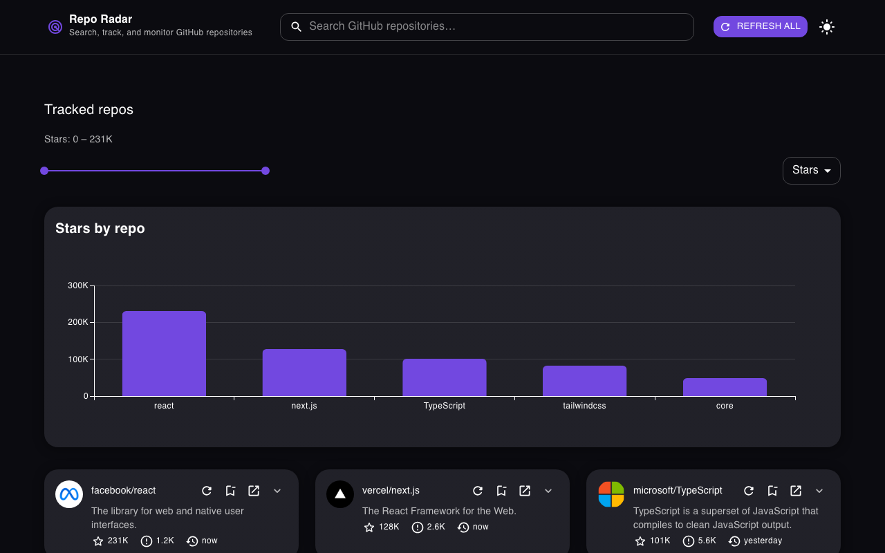
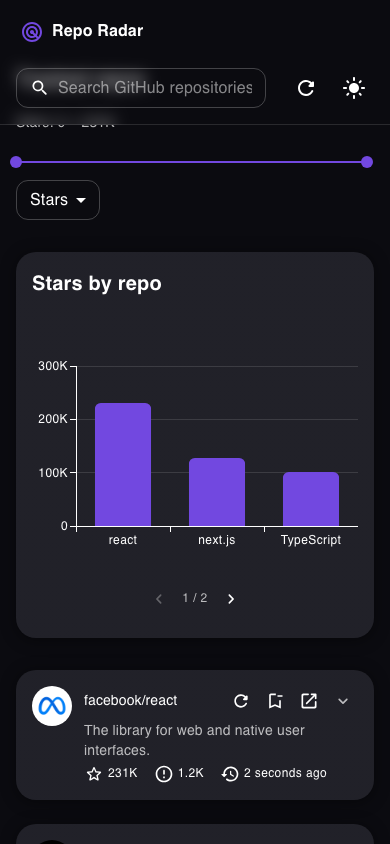
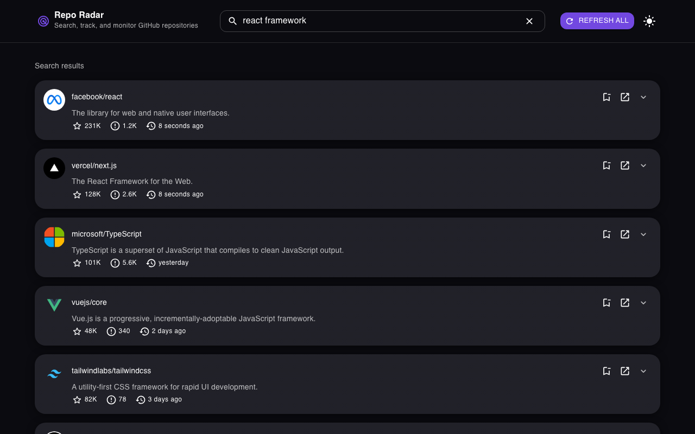
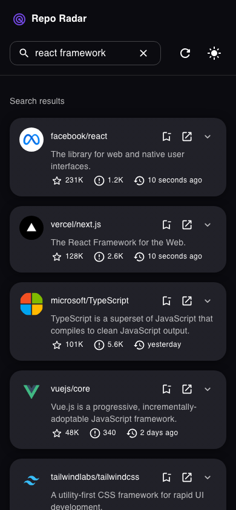
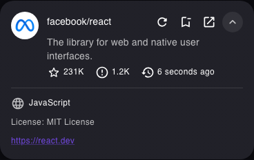
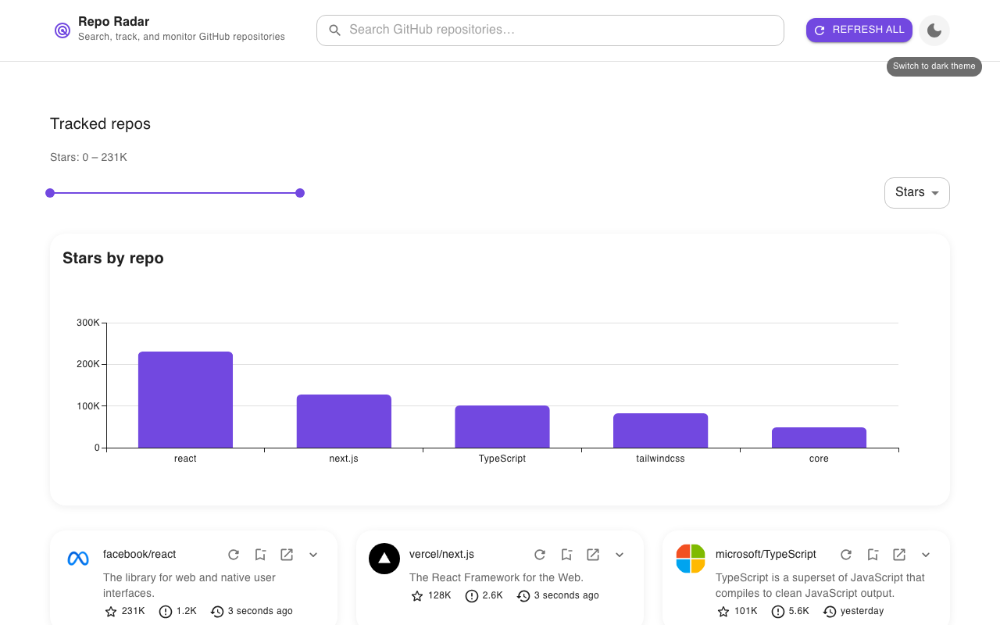
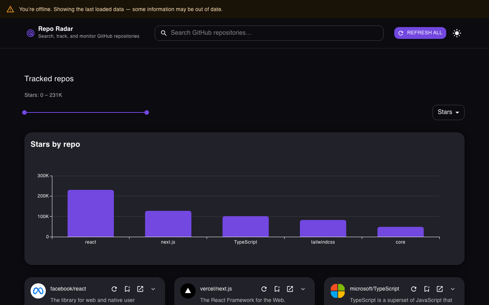

# Features

Repo Radar is a small dashboard for keeping an eye on GitHub repositories you care about.
Search for a project, track it, and the dashboard keeps its star count, open issues, and
last-commit time up to date for you — no GitHub account or sign-in required.

This page walks through what it does, with screenshots from both a phone-sized screen and a
desktop-sized one, since the app is built to work well at either.

## Tracked repos dashboard

The home screen is your dashboard: every repository you've tracked, laid out as cards, with a
chart above them showing star counts at a glance. Nothing to track yet? You'll see a friendly
empty state instead, with a nudge to search for something above.

| Desktop                                                                                                                                                     | Mobile                                                                                                             |
| ----------------------------------------------------------------------------------------------------------------------------------------------------------- | ------------------------------------------------------------------------------------------------------------------ |
|  |  |

## Search

Start typing in the search box in the header and results appear automatically after a couple of
characters — no need to press Enter. Results load a page at a time, with a "Load more" button for
digging further in, and each one shows the same at-a-glance stats as a tracked card: stars, open
issues, and when it was last pushed to.

| Desktop                                                                                                                                               | Mobile                                                                      |
| ----------------------------------------------------------------------------------------------------------------------------------------------------- | --------------------------------------------------------------------------- |
|  |  |

If a search comes up empty, or a request fails, you'll see a clear message instead of a blank
screen — and if something fails partway through loading more results, whatever already loaded
stays on screen while you retry, instead of the whole list disappearing.

## Tracking and untracking

Every repo card — in search results or on the dashboard — has a bookmark icon. Click it once to
track a repo, click it again to untrack it. Tracked repos are saved on your device, so they're
still there the next time you open the app, even after closing the tab or restarting your
browser.

## Repo cards, and the details underneath

Each card shows the essentials up front: the repo's avatar, name, description, star count, open
issue count, and how long ago it was last pushed to. Click the chevron on a card to expand it for
more — the primary language, license, and homepage link, if the repo has one.

Every card also has a shortcut to open the repo directly on GitHub, and (for tracked repos) a
refresh button to pull its latest stats on demand.

## Sorting and filtering tracked repos

Above the dashboard's cards, a control bar lets you sort tracked repos by star count, most
recently pushed, or name — and a range slider lets you filter down to repos within a star-count
range you choose. Clear the filter with one click if it doesn't turn up what you expected. Both
the sort order and the filter range are saved in the page's URL, so a link you share opens to the
same view you were looking at.

## Stars chart

The bar chart above your tracked repos plots star counts side by side, so it's easy to see which
of your tracked projects is the most popular at a glance. On a narrower screen it shows fewer bars
per page to stay readable, with arrows to page through the rest.

## Light and dark themes

Toggle between a light and a dark look with the sun/moon icon in the header. The app defaults to
dark, and remembers your choice for next time.

| Dark (default)                                                     | Light                                                                         |
| ------------------------------------------------------------------ | ----------------------------------------------------------------------------- |
|  |  |

## Staying useful when your connection drops

If your browser goes offline, a banner appears letting you know — and everything you'd already
loaded stays right where it was, so you can still see your tracked repos' last-known stats. The
banner disappears again as soon as your connection comes back.

Behind the scenes, a failed request to GitHub is retried automatically for the kinds of failures
that are usually temporary (a dropped connection, a brief server hiccup) — and if your device was
offline and reconnects, anything that failed while you were disconnected quietly retries on its
own.

## Built to be used comfortably

A few things you might not notice, because they're meant to just work:

- **Keyboard and screen-reader friendly.** A "skip to main content" link, clear status
  announcements when things load or fail, and every interactive element has a real accessible
  name — checked automatically as part of this project's test suite.
- **Shareable links.** What you searched for, which page of results you're on, and how the
  dashboard is sorted and filtered all live in the URL, so copying the link from your address bar
  shares the exact view you're looking at.
- **Handles a lot of tracked repos.** Track a handful or track a thousand — the list only renders
  what's actually on screen, so it stays smooth either way.
